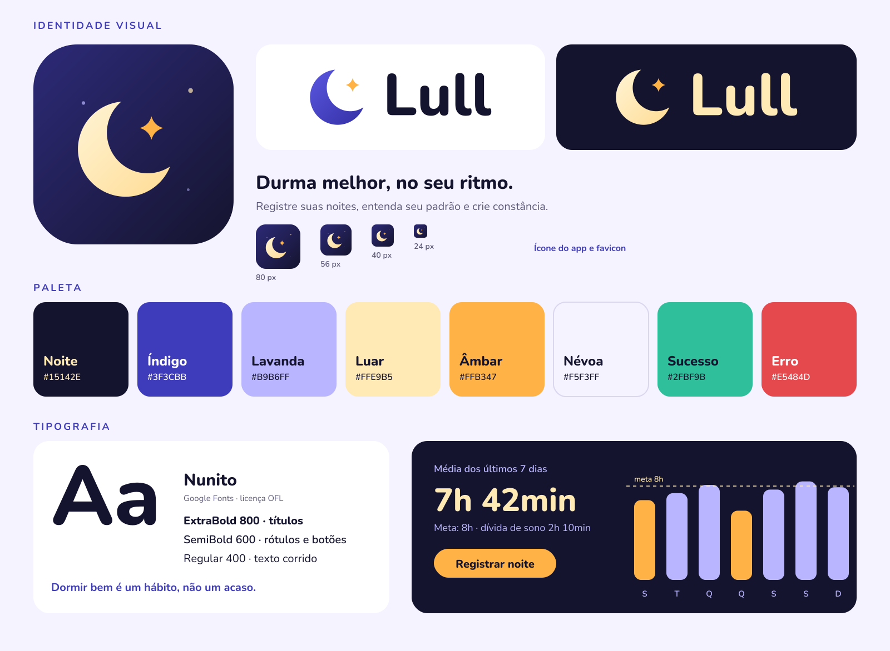

# Identidade visual: Lull

## Conceito
**Lull** vem de *lullaby* (cantiga de ninar) e do verbo que significa acalmar, embalar para dormir. É curto, fácil de falar e combina com a lua em formato de berço que abraça uma estrela: o sono como algo que se cuida. O visual é noturno, macio e calmo, sem parecer infantil.

- **Personalidade:** calma, acolhedora, confiável, simples.
- **Tom de voz:** próximo e gentil, sem culpa ("Que tal dormir um pouco mais cedo hoje?" em vez de "Você dormiu mal").
- **Slogan:** *Durma melhor, no seu ritmo.*
- **Atenção ao nome:** antes de publicar, confira domínio, nome no GitHub, lojas de apps e INPI. Nomes curtos costumam já estar em uso, e um complemento ajuda a se destacar nas buscas (ex.: "Lull - Diário do Sono").

## Logo
| Arquivo | Uso |
|---|---|
| `assets/brand/icon.svg` / `icon-512.png` | Ícone do app (PWA, loja, redes sociais) |
| `assets/brand/icon-maskable.svg` / `icon-maskable-512.png` | Ícone PWA "maskable" (sem cantos arredondados; o sistema recorta) |
| `assets/brand/favicon.svg` / `favicon-32.png` | Aba do navegador |
| `assets/brand/logo-horizontal-light.svg` | Logo com texto para **fundo claro** |
| `assets/brand/logo-horizontal-dark.svg` | Logo com texto para **fundo escuro** |
| `assets/brand/mark-light.svg` / `mark-dark.svg` | Só a lua com a estrela, sem fundo |

**Regras de uso**
- Área livre ao redor do logo: no mínimo a altura da letra "N".
- Tamanho mínimo: ícone 24 px; logo horizontal 96 px de largura.
- Não esticar, girar, trocar as cores nem aplicar sombras no logo.
- Fundo claro usa a versão `light`; fundo escuro usa `dark`. Não colocar o logo sobre fotos sem uma camada escura por trás.

## Paleta
| Nome | Hex | Uso |
|---|---|---|
| Noite | `#15142E` | Fundo escuro, texto em fundo claro |
| Índigo | `#3F3CBB` | Cor primária (links, elementos interativos) |
| Lavanda | `#B9B6FF` | Detalhes, texto secundário em fundo escuro, barras de gráfico |
| Luar | `#FFE9B5` | Destaques em fundo escuro (números grandes, títulos) |
| Âmbar | `#FFB347` | **Ação principal** (botão), estrela do logo, valores abaixo da meta |
| Névoa | `#F5F3FF` | Fundo claro das telas |
| Sucesso | `#2FBF9B` | Confirmações |
| Erro | `#E5484D` | Erros |

**Contraste (WCAG)**, calculado a partir dos valores acima:

| Combinação | Razão | Pode usar para texto? |
|---|---|---|
| Noite sobre Névoa | 16,35:1 | Sim |
| Índigo sobre Névoa | 7,43:1 | Sim |
| Índigo sobre Branco | 8,15:1 | Sim |
| Luar sobre Noite | 15,00:1 | Sim |
| Lavanda sobre Noite | 9,56:1 | Sim |
| Âmbar sobre Noite | 10,07:1 | Sim |
| Noite sobre Âmbar (texto do botão) | 10,07:1 | Sim |
| Erro sobre Névoa | 3,57:1 | Só texto grande ou com ícone |
| Sucesso sobre Névoa | 2,12:1 | **Não**; usar só com ícone ou fundo |
| Âmbar sobre Névoa | 1,62:1 | **Não**; nunca texto ou ícone fino em fundo claro |

Regra prática: no fundo claro o texto é Noite ou Índigo. Âmbar em fundo claro só como preenchimento de botão (com texto Noite).

## Tipografia
**Nunito** (Google Fonts, licença SIL OFL, gratuita, inclusive para uso comercial). A licença está em `assets/brand/Nunito-OFL.txt`.

| Uso | Peso | Tamanho sugerido |
|---|---|---|
| Títulos | 800 | 32 a 44 px |
| Subtítulos e rótulos | 700 / 600 | 16 a 24 px |
| Texto corrido | 400 | 16 px (mínimo 14 px) |
| Números de destaque (ex.: 7h 42min) | 800 | 44 a 58 px, cor Luar em fundo escuro |

Para usar no front-end, importe `assets/brand/tokens.css` (ele já carrega a fonte e define as variáveis de cor, tipografia, espaçamento e raios).

## Componentes (diretrizes rápidas)
- **Botão principal:** fundo Âmbar, texto Noite, peso 800, formato pílula.
- **Cartões:** fundo branco em telas claras ou Noite em telas escuras, raio 28 px, sombra suave.
- **Gráficos:** barras Lavanda; barras abaixo da meta em Âmbar; linha da meta tracejada em Luar.
- **Modo escuro:** é o "modo natural" do app (uso à noite). Considerar como padrão ao anoitecer.
- **Acessibilidade:** não depender só de cor para passar informação (use também ícone ou texto) e manter alvos de toque de pelo menos 44 px.

## Como foi gerado
Os arquivos foram gerados por script a partir de formas geométricas e do traçado da fonte Nunito ExtraBold convertido em curvas (o logo não depende de a fonte estar instalada). Se quiser trocar o nome, é só regerar o logo horizontal com o novo nome.

## Próximos passos
- [ ] Validar a disponibilidade do nome (domínio, GitHub, lojas, INPI)
- [ ] Testar o ícone em fundo claro e escuro no celular de verdade
- [ ] Referenciar `icon-192.png` e `icon-512.png` no `manifest.json` do PWA (issue do pós-MVP)
